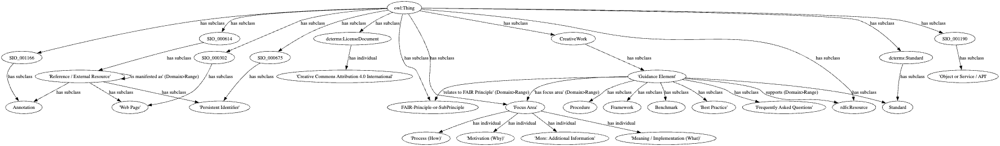

# FAIR Guidance Vocabulary (FTR)

Repository to track the requirements and specifications of the FAIR guidance vocabulary ontology. It is a model for the encoding, dissemination, and linking of guidance to assessment concepts.

**Permanent identifier:** [https://w3id.org/fgv#](https://w3id.org/fgv#) (click to see documentation and examples)

**Authors**: W. Hugo, W. Steinhoff, M. Priddy

**Working document**: [https://docs.google.com/presentation/d/1t76YNBzeDmZSNqVFparUunX4v5EvN5DZrUjOOH7loqw](https://docs.google.com/presentation/d/1t76YNBzeDmZSNqVFparUunX4v5EvN5DZrUjOOH7loqw), with inputs from initial modeling by other EU projects, such as: [FAIRCORE4EOSC](https://faircore4eosc.eu/) and [FAIR-IMPACT](https://fair-impact.eu/).

The proposed vocabulary has been created within T3.4 (WP3) and has been tested and shaped by community events feedback, such as OSTrails Hackathons and the FAIR-IMPACT all hands meeting.

## Core Ontology Guidance Elements 
The following main concepts have been identified:  
<ul>
<li>**GuidanceElement**: A discrete item of guidance (standard, procedure, FAQ, etc.) that can be categorized by one or more Guidance Dimensions such as Domain, Motivation, Actor, etc.   
<li>**ExternalResource**:  
<li>**FocusArea**:  
</ul>

## Examples
Please see the [latest specification draft for examples](https://w3id.org/fgv#intro).   
Demo FAIR Guidance (FGV) implementation dashboard: [https://fairassessment.dansdemo.nl/guidance](https://fairassessment.dansdemo.nl/guidance)

---
*This work is carried out in the context of the [https://ostrails.eu/](OSTrails project), funded by the European Union’s Horizon Europe framework programme under grant agreement No. 101130187.
Main development by Task 3.4: "Enhancing “assessment” with “guidance”", as part of the working package 3 (WP3): "Assessment tools & services".*  
